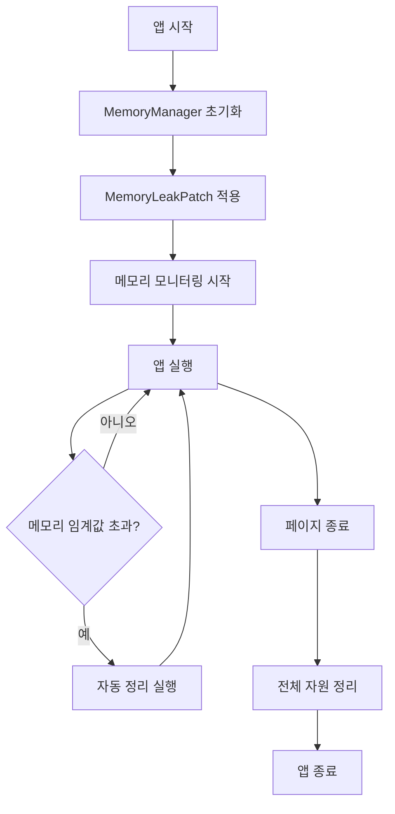

# MemoryManager 사용 가이드

## 🧹 개요

lonely-care 프로젝트의 메모리 누수 문제를 해결하기 위한 포괄적인 메모리 관리 시스템입니다. 생명 구조 서비스의 안정성을 위해 장시간 실행 시에도 안정적인 메모리 사용을 보장합니다.

## ⚠️ 발견된 메모리 누수 문제들

### 1. **friend-status-monitor.js**
- ❌ 인터벌 타이머 정리 누락
- ❌ Firebase 실시간 리스너 해제 누락

### 2. **motion-detector.js**
- ❌ DeviceMotion/Orientation 센서 리스너 정리 안됨
- ❌ 터치 이벤트 리스너 해제 누락
- ❌ 하트비트 인터벌 정리 안됨

### 3. **notifications.js**
- ❌ 모달 이벤트 리스너 정리 안됨
- ❌ Page Visibility API 리스너 해제 누락

### 4. **firebase-client.js**
- ❌ Firebase onSnapshot 구독 해제 안됨
- ❌ 실시간 구독자 누적

### 5. **enhanced-motion-detector.js**
- ❌ 다중 타이머 누수
- ❌ 센서 리스너 누수 (더 심각)

## 🛡️ MemoryManager 주요 기능

### 1. **자원 추적 및 관리**
- ✅ setInterval/setTimeout 추적
- ✅ 이벤트 리스너 추적
- ✅ Firebase 구독 추적
- ✅ 컴포넌트 생명주기 관리

### 2. **메모리 모니터링**
- ✅ 실시간 메모리 사용량 모니터링
- ✅ 임계값 초과 시 자동 정리
- ✅ 강제 가비지 컬렉션 실행

### 3. **안전한 정리**
- ✅ 페이지 언로드 시 자동 정리
- ✅ 백그라운드 진입 시 최적화
- ✅ 컴포넌트별 개별 정리

## 🚀 기본 사용법

### HTML에서 로드

```html
<!-- 1. MemoryManager 먼저 로드 -->
<script src="components/core/MemoryManager.js"></script>

<!-- 2. MemoryLeakPatch 로드 (기존 코드 패치) -->
<script src="components/core/MemoryLeakPatch.js"></script>

<!-- 3. 기존 앱 코드들... -->
<script src="js/main.js"></script>
<script src="js/friend-status-monitor.js"></script>
```

### 새로운 코드에서 안전한 자원 사용

```javascript
// ❌ 기존 방식 (메모리 누수 위험)
setInterval(() => {
    console.log('체크');
}, 1000);

// ✅ 안전한 방식
const memoryManager = window.getMemoryManager();
const interval = memoryManager.setInterval(() => {
    console.log('체크');
}, 1000);

// 필요할 때 정리
interval.clear();
```

### 이벤트 리스너 안전 관리

```javascript
// ❌ 기존 방식
document.getElementById('button').addEventListener('click', handler);

// ✅ 안전한 방식
const memoryManager = window.getMemoryManager();
const listener = memoryManager.addEventListener(
    document.getElementById('button'),
    'click',
    handler
);

// 필요할 때 정리
listener.remove();
```

### Firebase 구독 관리

```javascript
// ✅ 안전한 Firebase 구독
const memoryManager = window.getMemoryManager();

const unsubscribe = db.collection('users').onSnapshot(callback);
const subscription = memoryManager.addFirebaseSubscription(
    unsubscribe,
    '사용자 컬렉션 모니터링'
);

// 필요할 때 정리
subscription.unsubscribe();
```

### 컴포넌트 등록

```javascript
class MyComponent {
    constructor() {
        this.memoryManager = window.getMemoryManager();
        this.timers = [];
        
        // 컴포넌트 등록
        this.memoryManager.registerComponent('myComponent', this, 'cleanup');
    }
    
    start() {
        const timer = this.memoryManager.setInterval(() => {
            this.doSomething();
        }, 1000);
        
        this.timers.push(timer);
    }
    
    cleanup() {
        console.log('컴포넌트 정리 중...');
        
        // 모든 타이머 정리
        this.timers.forEach(timer => timer.clear());
        this.timers = [];
        
        console.log('컴포넌트 정리 완료');
    }
}
```

## 🔧 고급 사용법

### 메모리 모니터링

```javascript
const memoryManager = window.getMemoryManager();

// 현재 메모리 사용량 확인
const memInfo = memoryManager.checkMemoryUsage();
console.log(`메모리 사용량: ${memInfo.usedMB}MB`);

// 메모리 상태 보고
memoryManager.reportMemoryStatus();

// 메모리 최적화 모드 활성화
memoryManager.enableMemoryOptimization();
```

### 강제 정리

```javascript
// 강제 정리 (메모리 부족 시)
memoryManager.forceCleanup();

// 전체 정리 (앱 종료 시)
memoryManager.cleanup();
```

### 정리 콜백 등록

```javascript
// 앱 종료 시 실행될 정리 함수 등록
memoryManager.addCleanupCallback(() => {
    // 사용자 정의 정리 로직
    console.log('앱 종료 시 정리 실행');
}, '사용자 정의 정리');
```

## 🔧 MemoryLeakPatch 사용법

MemoryLeakPatch는 기존 코드를 수정하지 않고 자동으로 메모리 누수를 해결합니다.

### 자동 패치 적용

```html
<!-- 패치가 자동으로 적용됩니다 -->
<script src="components/core/MemoryLeakPatch.js"></script>
```

### 패치 상태 확인

```javascript
const patch = window.getMemoryLeakPatch();

// 패치 상태 확인
const status = patch.getPatchStatus();
console.log('패치 적용 상태:', status);

// 패치된 컴포넌트 보고
patch.reportPatchedComponentsStatus();
```

## 📊 메모리 모니터링 대시보드

### 브라우저 콘솔에서 실행

```javascript
// 메모리 상태 확인
const memoryManager = window.getMemoryManager();
console.log('=== 메모리 상태 ===');
console.log('사용량:', memoryManager.checkMemoryUsage());
console.log('활성 자원:', {
    intervals: memoryManager.activeIntervals.size,
    timeouts: memoryManager.activeTimeouts.size,
    listeners: memoryManager.activeListeners.size,
    firebase: memoryManager.activeFirebaseSubscriptions.size,
    components: memoryManager.activeComponents.size
});
```

### 정기적 모니터링

```javascript
// 5초마다 메모리 상태 출력
const memoryManager = window.getMemoryManager();
const monitor = memoryManager.setInterval(() => {
    const mem = memoryManager.checkMemoryUsage();
    if (mem) {
        console.log(`📊 메모리: ${mem.usedMB}MB / ${mem.totalMB}MB`);
    }
}, 5000);
```

## ⚠️ 주의사항

### 1. **기존 코드와의 호환성**
- MemoryLeakPatch는 기존 코드를 보호합니다
- 원본 함수들을 백업하고 복원 가능합니다
- Level 1 보호 컴포넌트는 건드리지 않습니다

### 2. **성능 고려사항**
```javascript
// 메모리 추적 비활성화 (성능 우선시 시)
window.ENABLE_MEMORY_PROTECTION = false;

// 메모리 추적 활성화 (안정성 우선시 시)
window.ENABLE_MEMORY_PROTECTION = true;
```

### 3. **디버깅**
```javascript
// 상세한 메모리 로그 활성화
window.MEMORY_DEBUG = true;

// 메모리 로그 비활성화
window.MEMORY_DEBUG = false;
```

## 🔄 생명주기 관리



## 🚨 생명 구조 시스템에 미치는 영향

### 개선 효과:
1. **🔋 배터리 수명 연장**: 불필요한 백그라운드 프로세스 제거
2. **🚀 성능 향상**: 메모리 누수로 인한 앱 느려짐 해결
3. **🛡️ 안정성 증대**: 앱 크래시 위험 최소화
4. **📱 반응성 개선**: 메모리 정리로 UI 응답 속도 향상

### 위험 요소 제거:
- ❌ 중복 알림 발송 방지
- ❌ 센서 오작동 방지
- ❌ Firebase 연결 불안정 해결
- ❌ 앱 종료 위험 제거

## 📈 모니터링 지표

### 성공 지표:
- 메모리 사용량 < 50MB 유지
- 활성 자원 수 < 50개 유지  
- 강제 정리 빈도 < 1회/시간
- 앱 크래시 0회/일

### 경고 지표:
- 메모리 사용량 > 30MB
- 활성 자원 수 > 30개
- Firebase 구독 > 10개
- 인터벌/타임아웃 > 20개

## 🔧 문제 해결

### Q1: 패치가 적용되지 않는 경우
```javascript
// 수동으로 패치 적용
setTimeout(() => {
    const patch = window.getMemoryLeakPatch();
    patch.applyPatches();
}, 5000);
```

### Q2: 메모리 사용량이 계속 증가하는 경우
```javascript
// 강제 정리 실행
const memoryManager = window.getMemoryManager();
memoryManager.forceCleanup();

// 가비지 컬렉션 요청
if (window.gc) window.gc();
```

### Q3: 특정 컴포넌트의 정리가 안되는 경우
```javascript
// 수동으로 컴포넌트 정리
const memoryManager = window.getMemoryManager();
memoryManager.unregisterComponent('componentName');
```

---

**💡 기억하세요**: 메모리 관리는 생명 구조 서비스의 안정성과 직결됩니다. 새로운 기능 개발 시 반드시 MemoryManager를 활용하세요.

**🚨 중요**: 기존 코드 수정 시에는 COMPONENT_GUIDE.md의 보호 수준을 확인하고, Level 1 파일은 절대 수정하지 마세요.